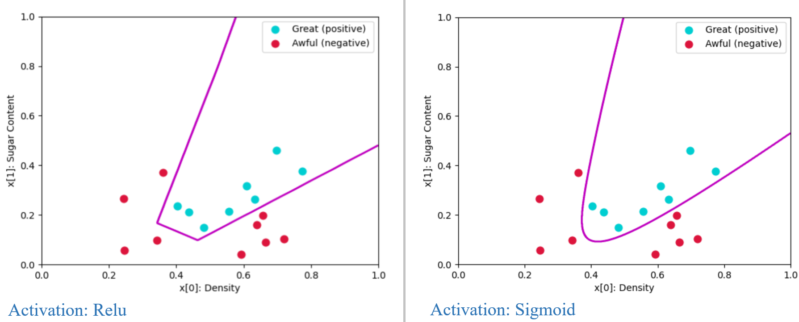

# Problem 5.5
试编程实现标准BP算法和累积BP算法，在西瓜数据集3.0上分别用这两个算法训练一个单隐层网络，并进行比较。

## Dataset
西瓜数据集3.0 @ `../WTMLDataSet_3.0.xlsx`
编号|	色泽|	根蒂|	敲声|	纹理|	脐部|	触感|	密度|	含糖率|	好瓜|
|-|-|-|-|-|-|-|-|-|-|
1|	青绿|	蜷缩|	浊响|	清晰|	凹陷|	硬滑|	0.697|	0.46|	是
2|	乌黑|	蜷缩|	沉闷|	清晰|	凹陷|	硬滑|	0.774|	0.376|	是
3|	乌黑|	蜷缩|	浊响|	清晰|	凹陷|	硬滑|	0.634|	0.264|	是
4|	青绿|	蜷缩|	沉闷|	清晰|	凹陷|	硬滑|	0.608|	0.318|	是
5|	浅白|	蜷缩|	浊响|	清晰|	凹陷|	硬滑|	0.556|	0.215|	是
6|	青绿|	稍蜷|	浊响|	清晰|	稍凹|	软粘|	0.403|	0.237|	是
7|	乌黑|	稍蜷|	浊响|	稍糊|	稍凹|	软粘|	0.481|	0.149|	是
8|	乌黑|	稍蜷|	浊响|	清晰|	稍凹|	硬滑|	0.437|	0.211|	是
9|	乌黑|	稍蜷|	沉闷|	稍糊|	稍凹|	硬滑|	0.666|	0.091|	否
10|	青绿|	硬挺|	清脆|	清晰|	平坦|	软粘|	0.243|	0.267|	否
11|	浅白|	硬挺|	清脆|	模糊|	平坦|	硬滑|	0.245|	0.057|	否
12|	浅白|	蜷缩|	浊响|	模糊|	平坦|	软粘|	0.343|	0.099|	否
13|	青绿|	稍蜷|	浊响|	稍糊|	凹陷|	硬滑|	0.639|	0.161|	否
14|	浅白|	稍蜷|	沉闷|	稍糊|	凹陷|	硬滑|	0.657|	0.198|	否
15|	乌黑|	稍蜷|	浊响|	清晰|	稍凹|	软粘|	0.36|	0.37|	否
16|	浅白|	蜷缩|	浊响|	模糊|	平坦|	硬滑|	0.593|	0.042|	否
17|	青绿|	蜷缩|	沉闷|	稍糊|	稍凹|	硬滑|	0.719|	0.103|	否


## Environment
- `python 3.7.0`  
- `xlrd 1.2.0`  
- `tqdm 4.50.2`  
- `numpy 1.19.2`  
- `matplotlib 3.3.2`  
- `graphviz 0.14.2`

## Usage
```Shell
python3 test.py
```

## Result
The trained Neural Network is as following:  
  

### Comparison  
Training 100 epochs.  
  
```Python
### After 100 epochs training ###
- Standard BP:    using time = 0.236s, loss = 0.3450, accuracy = 85.71%
- Accumulated BP: using time = 0.041s, loss = 0.8702, accuracy = 71.43%
```
It's proved that Standard BP takes more time than Accumulated BP when training the same number of epochs. However, Accumulated BP meets the problem that gradient descend slowly after a specified number of epochs, but Standard BP doesn't.

## P.S.
In order to visualize Neural Network, I also train Neural Network with watermelon dataset 3.0α whose data only have two attributes. The cmd is ```python test_alpha.py```. Then you can see the boundary that Neural Network (use Relu and Sigmoid respectively as activation function) draws on dataset.  
  