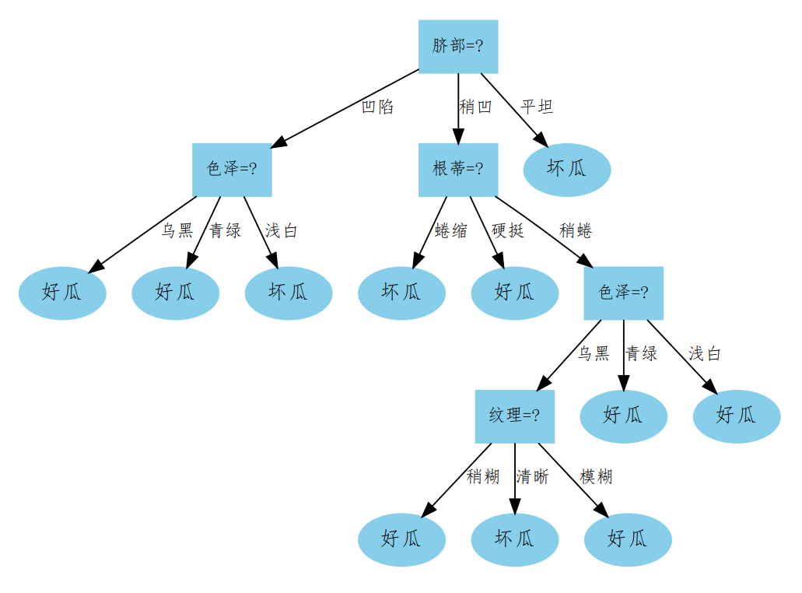
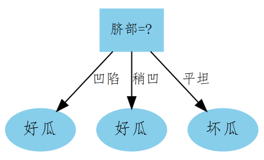
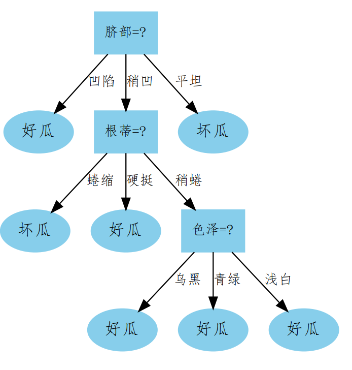

# Problem 4.4
试编程实现基于基尼指数进行划分选择的决策树算法，为表4.2（西瓜数据集2.0）中数据生成预剪枝、后剪枝决策树，并与未剪枝决策树进行比较。

## Dataset
西瓜数据集2.0 @ `../WTMLDataSet_2.0.xlsx`  
<br>
训练集：

编号|	色泽|	根蒂|	敲声|	纹理|	脐部|	触感|	好瓜|
|-|-|-|-|-|-|-|-|-|-|
1|	青绿|	蜷缩|	浊响|	清晰|	凹陷|	硬滑|	是
2|	乌黑|	蜷缩|	沉闷|	清晰|	凹陷|	硬滑|	是
3|	乌黑|	蜷缩|	浊响|	清晰|	凹陷|	硬滑|	是
6|	青绿|	稍蜷|	浊响|	清晰|	稍凹|	软粘|	是
7|	乌黑|	稍蜷|	浊响|	稍糊|	稍凹|	软粘|	是
10|	青绿|	硬挺|	清脆|	清晰|	平坦|	软粘|	否
14|	浅白|	稍蜷|	沉闷|	稍糊|	凹陷|	硬滑|	否
15|	乌黑|	稍蜷|	浊响|	清晰|	稍凹|	软粘|	否
16|	浅白|	蜷缩|	浊响|	模糊|	平坦|	硬滑|	否
17|	青绿|	蜷缩|	沉闷|	稍糊|	稍凹|	硬滑|	否
<br>
测试集：

编号|	色泽|	根蒂|	敲声|	纹理|	脐部|	触感|	好瓜|
|-|-|-|-|-|-|-|-|-|-|
4|	青绿|	蜷缩|	沉闷|	清晰|	凹陷|	硬滑|	是
5|	浅白|	蜷缩|	浊响|	清晰|	凹陷|	硬滑|	是
8|	乌黑|	稍蜷|	浊响|	清晰|	稍凹|	硬滑|	是
9|	乌黑|	稍蜷|	沉闷|	稍糊|	稍凹|	硬滑|	否
11|	浅白|	硬挺|	清脆|	模糊|	平坦|	硬滑|	否
12|	浅白|	蜷缩|	浊响|	模糊|	平坦|	软粘|	否
13|	青绿|	稍蜷|	浊响|	稍糊|	凹陷|	硬滑|	否

## Environment
- `python 3.5.4`  
- `xlrd 1.2.0`  
- `numpy 1.18.5`
- `graphviz 0.14.2`

## Usage
```Shell
python3 test.py
```

## Result
No Pruning  

Decision Tree without pruning is easy to overfit.

<br>

Pre-pruning  

Pre-pruning prunes some branches to avoid overfitting, but it's easy to cause the case of under-fitting at the same time.

<br>

Post-pruning

Post-pruning could avoids both overfitting and under-fiiting.