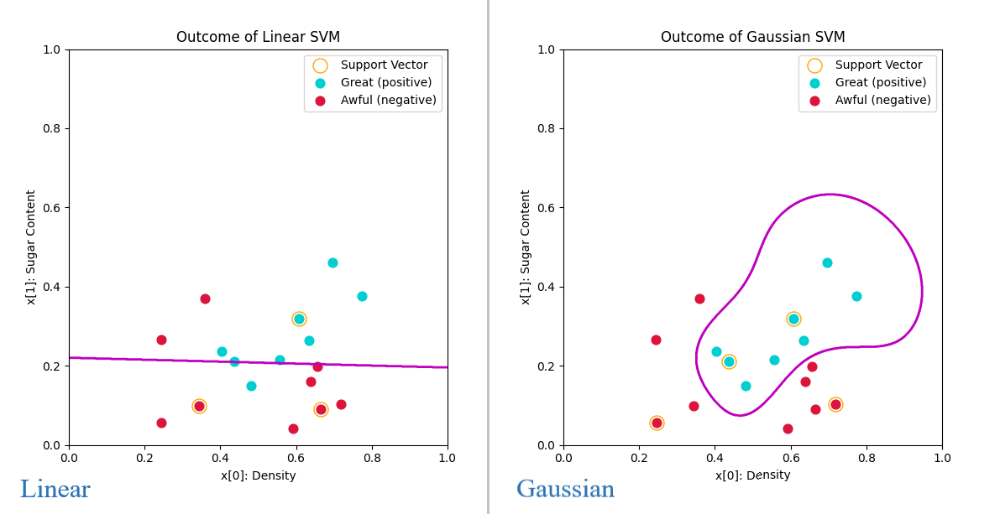

# Problem 6.2
试使用LIBSVM（×），在西瓜数据集3.0α上分别用线性核和高斯核训练一个SVM，并比较其支持向量的差别。

## Dataset
西瓜数据集3.0 @ `../WTMLDataSet_3.0.xlsx`
编号|	色泽|	根蒂|	敲声|	纹理|	脐部|	触感|	密度|	含糖率|	好瓜|
|-|-|-|-|-|-|-|-|-|-|
1|	青绿|	蜷缩|	浊响|	清晰|	凹陷|	硬滑|	0.697|	0.46|	是
2|	乌黑|	蜷缩|	沉闷|	清晰|	凹陷|	硬滑|	0.774|	0.376|	是
3|	乌黑|	蜷缩|	浊响|	清晰|	凹陷|	硬滑|	0.634|	0.264|	是
4|	青绿|	蜷缩|	沉闷|	清晰|	凹陷|	硬滑|	0.608|	0.318|	是
5|	浅白|	蜷缩|	浊响|	清晰|	凹陷|	硬滑|	0.556|	0.215|	是
6|	青绿|	稍蜷|	浊响|	清晰|	稍凹|	软粘|	0.403|	0.237|	是
7|	乌黑|	稍蜷|	浊响|	稍糊|	稍凹|	软粘|	0.481|	0.149|	是
8|	乌黑|	稍蜷|	浊响|	清晰|	稍凹|	硬滑|	0.437|	0.211|	是
9|	乌黑|	稍蜷|	沉闷|	稍糊|	稍凹|	硬滑|	0.666|	0.091|	否
10|	青绿|	硬挺|	清脆|	清晰|	平坦|	软粘|	0.243|	0.267|	否
11|	浅白|	硬挺|	清脆|	模糊|	平坦|	硬滑|	0.245|	0.057|	否
12|	浅白|	蜷缩|	浊响|	模糊|	平坦|	软粘|	0.343|	0.099|	否
13|	青绿|	稍蜷|	浊响|	稍糊|	凹陷|	硬滑|	0.639|	0.161|	否
14|	浅白|	稍蜷|	沉闷|	稍糊|	凹陷|	硬滑|	0.657|	0.198|	否
15|	乌黑|	稍蜷|	浊响|	清晰|	稍凹|	软粘|	0.36|	0.37|	否
16|	浅白|	蜷缩|	浊响|	模糊|	平坦|	硬滑|	0.593|	0.042|	否
17|	青绿|	蜷缩|	沉闷|	稍糊|	稍凹|	硬滑|	0.719|	0.103|	否


## Environment
- `python 3.7.0`  
- `xlrd 1.2.0`  
- `tqdm 4.50.2`  
- `numpy 1.19.2`  
- `matplotlib 3.3.2`  
- `graphviz 0.14.2`

## Usage
```Shell
python3 test.py
```

## Outcome
The support vectors and separating hyperplane of SVM with ```Linear``` kernel and ```Gaussian``` kernel respectively, are as following.
