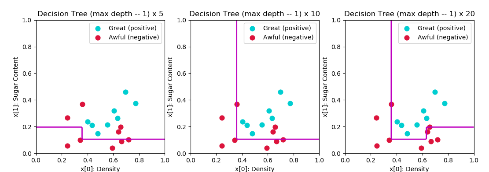
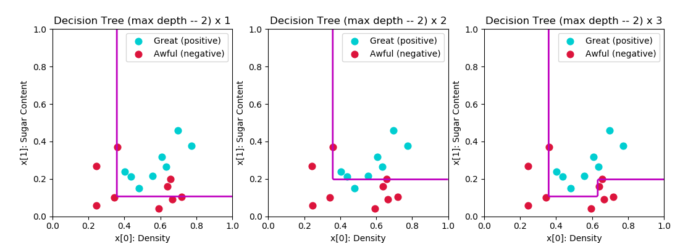

# Problem 8.3
从网上下载或自己编程实现AdaBoost，以不剪枝决策树为基学习器，在西瓜数据集3.0α上训练一个AdaBoost集成，并与图8.4进行比较。  

## Dataset
西瓜数据集3.0α @ `../WTMLDataSet_3.0alpha.xlsx`
编号|	密度|	含糖率|	好瓜
|--| --|--|--|
1|	0.697|	0.46|	1|
2|	0.774|	0.376|	1|
3|	0.634|	0.264|	1|
4|	0.608|	0.318|	1|
5|	0.556|	0.215|	1|
6|	0.403|	0.237|	1|
7|	0.481|	0.149|	1|
8|	0.437|	0.211|	1|
9|	0.666|	0.091|	0|
10|	0.243|	0.267|	0|
11|	0.245|	0.057|	0|
12|	0.343|	0.099|	0|
13|	0.639|	0.161|	0|
14|	0.657|	0.198|	0|
15|	0.36|	0.37|	0|
16|	0.593|	0.042|	0|
17|	0.719|	0.103|	0|

## Environment
- `python 3.7.0`  
- `xlrd 1.2.0`  
- `numpy 1.19.2`  
- `matplotlib 3.3.2`  
- `graphviz 0.14.2`

## Usage
```Shell
python3 main.py
```

## Outcome
Boundaries that AdaBoost draws on dataset, corresponding to 5, 10, 20 decision trees (whose max depth is 1).  
  

</br>

Boundaries that AdaBoost draws on dataset, corresponding to 1, 2, 3 decision trees (whose max depth is 2).  
  

</br>

#### Accuracy
```
- Decision Tree (max depth -- 1) x 5    :    0.76
- Decision Tree (max depth -- 1) x 10   :    0.88
- Decision Tree (max depth -- 1) x 20   :    1.00

- Decision Tree (max depth -- 2) x 1    :    0.88
- Decision Tree (max depth -- 2) x 2    :    0.94
- Decision Tree (max depth -- 2) x 3    :    1.00
```
